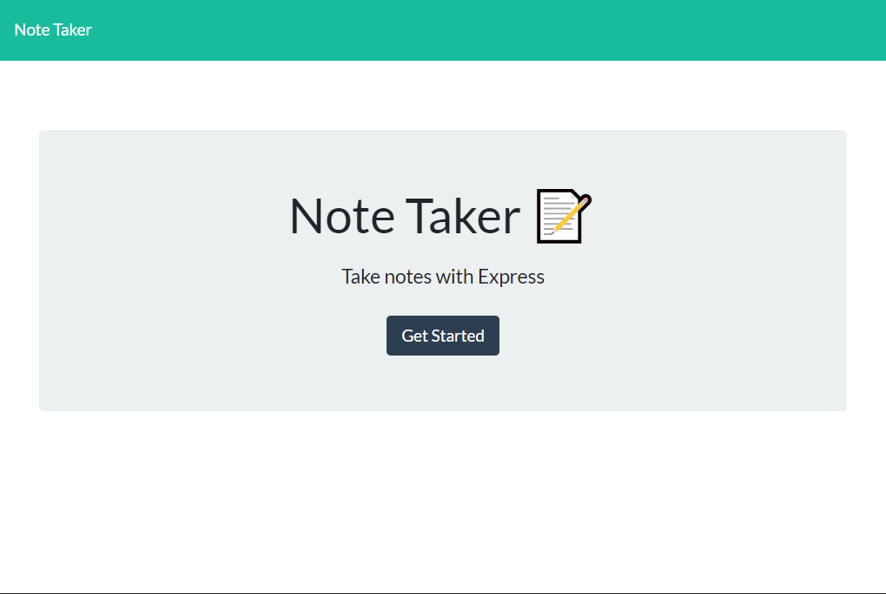
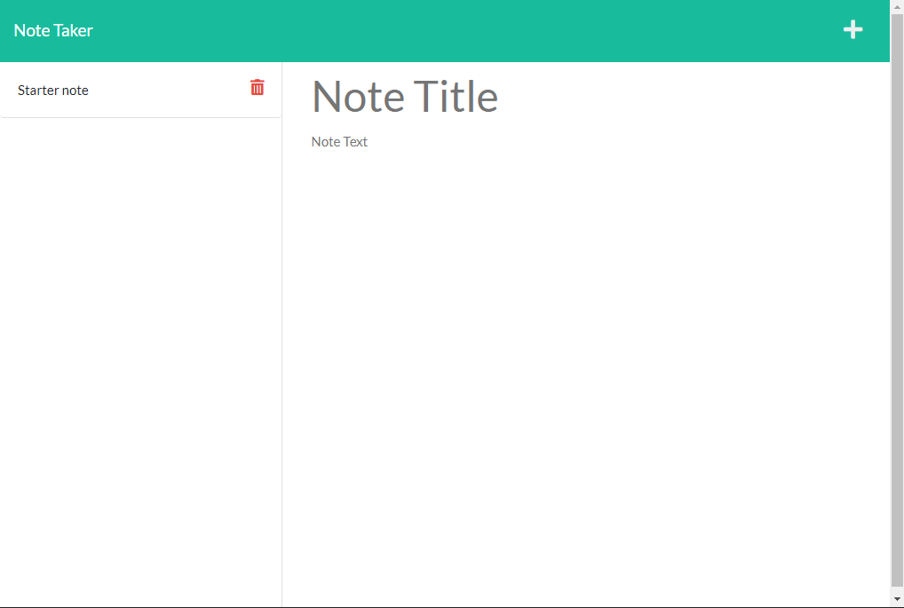
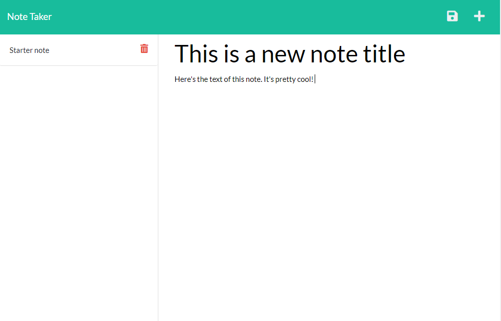

# note-taker
A note taking app that anyone can modify!

## Table of Contents
* [Installation](#Installation)
* [Usage](#Usage)
* [Technologies](#technologies-used)
* [License](#License)
* [Tests](#Tests)

## Installation

A deployed version can be found at https://floating-forest-47712.herokuapp.com/

To run it yourself you need to install [Node.js](https://nodejs.org/en/). After
you've done that download the repository and then run `npm install` in the 
directory you downloaded it to. Once that completes you can run it locally using
`npm start`, `npm watch`, or `node ./server.js` commands within the directory 
you installed it to. 

By default you can see it deployed to `localhost:3000`

## Usage

Once you've either installed the application or you've visited the [deployed 
website](https://floating-forest-47712.herokuapp.com/) The usage is straight
forward. First you'll be greated by a splash screen

    

You can either click the "get started" button or the title in the upper left,
both work to continue. They will send you to the note editing screen. 

    

By default a note will be made that has some basic information about the 
deployment. Clicking on each note will allow you to edit their information by 
propogating it to the main area.

You can also click the `+` button to clear that area.

Once you type a note a save icon will appear 

    

Clicking the floppy disk will allow you to write the file to the database. 

## Technologies used

|Technologies used |
|------------------|
||
||
||
||
||
||
||

The Database that is used isn't actually a real one. It's in fact just a JSON
file that gets edited by the API requests the client sends over. It doesn't use
local storage so anything you change will stay on everyone's computer. BUT 

## Credits

Markdown badges shamelessly pinched from: 
https://github.com/Ileriayo/markdown-badges

The starter code was part of the UC Berkeley Coding Bootcamp. I wrote the 
routing, and API that allows the "database" to create and delete notes. Much 
of the HTML was already made for me. This was mostly about learning how to make
an API with node.

## License
Copyright 2022

## Tests

Testing was done using the node package Jest, and the application Insomnia for
API calls/requests. 

There was only one custom class that was tested and that was for the notes. It
wasn't particularly complicated but it used an node package called 
[uuid](https://www.npmjs.com/package/uuid) to generate ID's for each note. 

UUIDs are a good way to ensure that ID's that are made don't collide, and can
persist through refreshes on the client side. 